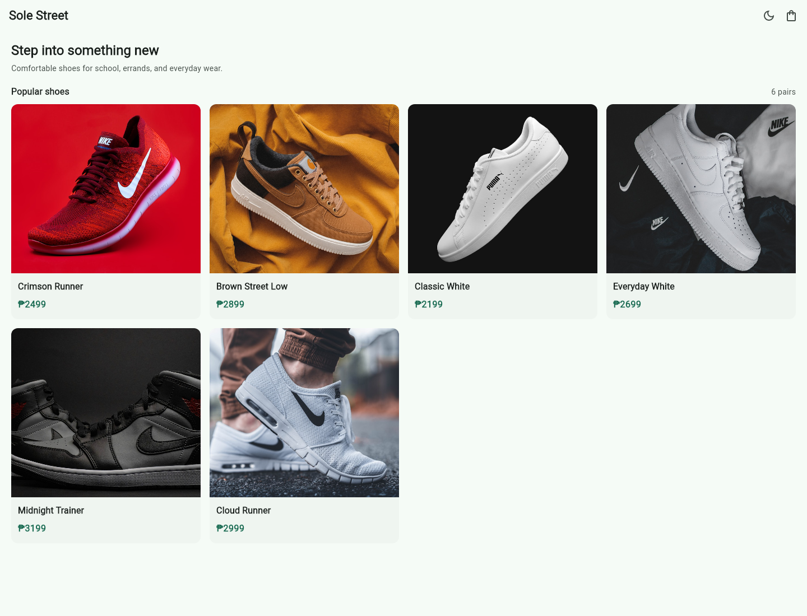

# Sole Street

A Flutter shoe-shop browser for the **CS Elective 2 Prelim Exam**.

**Submission branch:** `PrelimExam`

**Shopping flow:** Home → Product Detail → Add to Cart → Cart → Checkout Confirmation



## Features

- Six products with locally bundled images
- Responsive product grid: two columns on phones, three on tablets, and four on large screens
- Product details with an Add to Cart button that reflects cart membership
- Cart quantity controls, item subtotals, and a live total
- Checkout confirmation with an order summary and empty-cart protection
- App-wide light/dark toggle on the Home AppBar
- Centralized colors, text styles, and component styles in ThemeData
- Navigation 2.0 using `go_router`

## Project Structure

| File | Purpose |
| --- | --- |
| `lib/main.dart` | Application entry point, router, theme state, and shared theme |
| `lib/product.dart` | Product data, cart items, and cart calculations |
| `lib/home_screen.dart` | Responsive product grid and product cards |
| `lib/product_detail_screen.dart` | Product information and Add to Cart |
| `lib/cart_screen.dart` | Quantity controls, subtotals, and total |
| `lib/checkout_screen.dart` | Confirmation and order summary |
| `assets/images/` | Bundled product photos |
| `test/widget_test.dart` | Theme, responsive layout, and shopping-flow tests |

## Run

Requires Flutter with Dart 3.12.2 or a compatible version.

```bash
flutter pub get
flutter run
```

## Validate

```bash
flutter analyze
flutter test
```

Product and cart data are held in memory. Checkout is a demonstration confirmation screen; the app does not process payments or place real orders.
